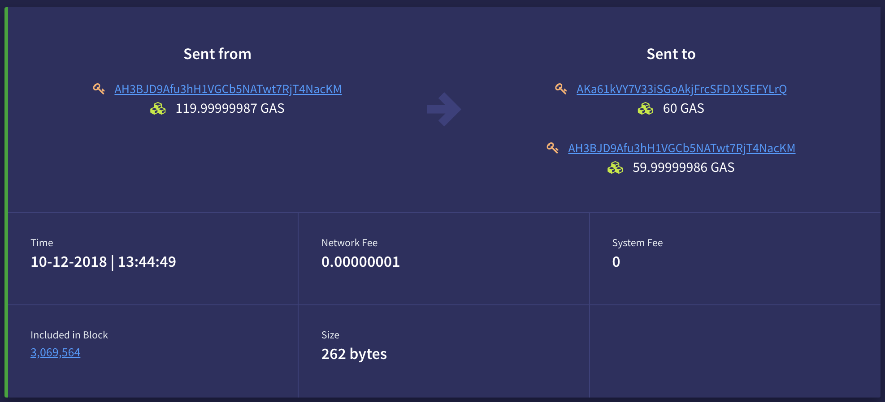

# 区块创建
## 共识节点

正如[第1部分](1-Introduction_to_blocks_and_blockchain.md)中所讨论的，NEO使用dBFT机制来生成区块。简而言之，这意味着网络会选择出一定数量的共识节点,且需要至少2/3个节点的共识才有可能生成新的区块。

每一轮共识期间都会有一个共识节点被选为议长。在最好的情况下，不会出现拜占庭节点，议长节点会发起一个新块提案，并将其向网络中的其他共识节点进行广播以达成共识。当从其他共识节点那获得足够多的签名时，区块就会被广播到网络中，且具有终局性。有关dBFT共识机制的更多详细信息，请参阅[白皮书](https://docs.neo.org/en-us/basic/consensus/whitepaper.html)。

## 新区块

用户想要发送交易，通常的做法是通过钱包创建交易并对交易进行签名，之后将其发送到RPC或P2P节点。 RPC和P2P节点都会向网络中继（有效）交易，最终交易会到达一个共识节点。更多内容请查看  [5. 网络](../5-network/)一节。这篇[Medium上的文章](https://medium.com/neoresearch/understanding-neo-network-in-five-pictures-e51b7c19d6e0)对这一机制也给出了一个很好概述。

一旦有效交易到达共识节点，它们就会被存储在节点的内存池中。创建新块时，会从这个内存池中选择要打包的交易。每个区块最多可以包含500笔交易，且第一个交易总是[MinerTransaction类型](../3-transaction/types.md#minertransaction)。

## 交易（网络）费用

议长节点会选择一些交易并将其打包进新块中。用户要想确保他的交易尽可能快地被执行时，可以选择支付一定的交易费用。目前是不需要交易费用的（不过每个区块只限有20笔免费的交易）。然而，用户可以选择支付交易费用来获得更高的优先级。费用越高，该交易就越有可能被打包进下一个区块中。这是因为内存池中的交易是按每字节支付的手续费进行排序的，且议长节点可以获得提案块所包含的交易的所有交易费用。这使得相较于免费交易而言，议长节点会更倾向于打包那些提供了更高手续费的交易。这笔交易费用不是一个特定的字段，而是在花费UTXO时没有被计入的剩余GAS。

这是因为UTXO是不可分割的，需要作为一个整体进行花费。例如，你想给朋友发送5 GAS，但钱包中只有一个价值500 GAS的UTXO。你无法直接将这个500 GAS的UTXO进行划分。你要做的是将这个500 GAS的UTXO作为输入来创建一个交易。此外还会向交易添加2个输出：5个GAS发送给你的朋友，剩下的495个发送回自己的账户。这可以与现实生活中的例子做个对比，当你给了收银员100美元，但实际只需支付1美元时，就会得到99美元的找零。UTXO也是类似的，你需要在同一笔交易中将剩余的零钱发送给自己。

未明确指出接收地址的每一单位的UTXO都会被解释为交易费用。继续前面的这个例子，你有一个495 GAS的UTXO。如果你在同一交易中，向朋友发送了另一个5 GAS的UTXO，且只发送回489 GAS给你自己，那么剩下的1 GAS就会被视为交易费用。事实上，你正在告诉共识节点说*零钱给你了*。

普通用户在用这种方式构建UTXO交易时不用担心这些问题。大多数高级钱包软件都会为用户提供指定交易费用的选项，并以这种方式生成交易，以便将零钱发送回你的账户。

作为一个示例，你可以看看[这个交易](https://neoscan.io/transaction/80b963d68c0f3d65c0e906057f7517a17ef7dcc1b29e2a79205e4aa235131f95)。

源地址有一个包含了119.99999987 GAS的UTXO，现在希望将其中的60 GAS发送到另一个地址。为此，指定了接收方地址并发送这60 GAS，同时将剩余的GAS（59.99999986 GAS）以花费的方式再次转回给自己。但是，60+59.99999986等于119.99999986 GAS。与原来的UTXO相差0.00000001 GAS，这就是隐含的交易费用。不指定UTXO中剩余的0.00000001GAS的接收地址，它就会被作为交易费用奖励给创建[相关区块](https://neoscan.io/block/eabb36acfb055592afb06786f831390762000a9aa669016d27eb031f41e14a07)的共识节点。

## 系统费

交易费用于获得网络的优先权。此外还有一些具有其他特定目的的费用，称为系统费。
 -  ***智能合约创建*** 当前在主网上部署新合约的费用为100-1000 GAS，具体费用由所需的功能（例如需要存储或者动态调用）和大小决定。对于结构化开发，建议先在[本地的私有测试网](https://github.com/CityOfZion/neo-local)上开始开发。一旦智能合约可以稳定执行了，就可以点击[此处](https://neo.org/testcoin/apply)申请测试网资金用于最后的验证。只有在能保证你的智能合约已经正确无误地实现的情况下，才能将其部署到主网上，因为这个操作是不可撤销的。这意味着即使销毁合约，也不会退回用于部署所支付的GAS。
 -  ***智能合约执行*** 要想能执行智能合约，节点需要执行特定的计算。为了奖励节点所做的工作，应该在执行合约的交易中附上一定的系统费用。目前，任意系统调用都有10个GAS的免费额度，也就是说，对于费用低于10 GAS的合约调用，不需要支付系统费用。 [本页](https://docs.neo.org/en-us/sc/systemfees.html)提供了执行智能合约所需系统费用的完整概述。对于每个操作，都说明了特定操作所需的费用。

# 区块广播

一旦共识节点根据dBFT机制对新块达成了共识，它们就会将这个新块广播到整个网络。由于dBFT共识机制的特性，实现了一区块终局性。这意味着所有客户端都可以在新块创建后立即查询区块链（任意RPC或P2P节点），并能保证这些交易是最终确定的。