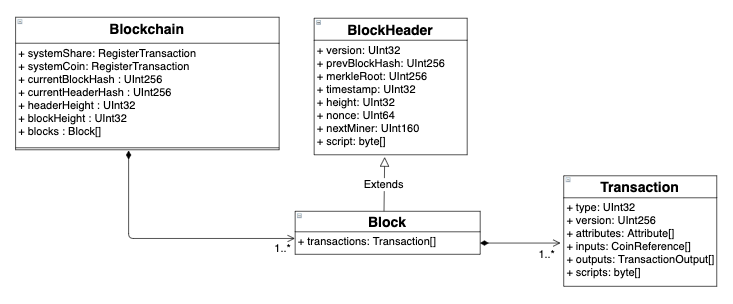
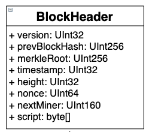
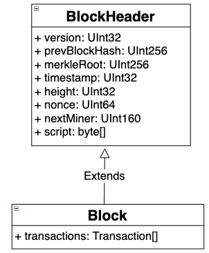

# Persistence

## Serialization Model
The native types in NEO platform are Integer, Decimal and String, UInt160 and UInt256.
This model is used for both the persistence and the network layer.


### Integer serialization
Integers are encoded using a variable length according to the value stored:

|Value|Length|Format|
|---|---|---|
|< 0xfd|1|uint8|
|<= 0xffff|3|0xfd + uint16|
|<= 0xffffffff|5|0xfe + uint32|
|> 0xffffffff|9|0xff + uint64|

The value 1 is stored using a single byte:


But the number 65535 is stored using 3 bytes:


#### Integer serialization in code
You can find [here](https://github.com/neo-project/neo/blob/b0793b74f25d817f826c4dca3f7f06a8b7dce88e/neo/IO/Helper.cs#L235) the code used to serialise integers in our C# version:

``` CSharp

public static void WriteVarInt(this BinaryWriter writer, long value)
{
  if (value < 0)
    throw new ArgumentOutOfRangeException();
  if (value < 0xFD)
  {
    writer.Write((byte)value);
  }
  else if (value <= 0xFFFF)
  {
    writer.Write((byte)0xFD);
    writer.Write((ushort)value);
  }
  else if (value <= 0xFFFFFFFF)
  {
    writer.Write((byte)0xFE);
    writer.Write((uint)value);
  }
  else
  {
    writer.Write((byte)0xFF);
    writer.Write(value);
  }
}

```

#### Byte order
All variable length integer of NEO are little endian except for IP address and port number.

### String serialization
Strings are encoded using variable length strings, consisting of variable length integer followed by the string encoded in UTF8.

|Size|Field|Type|Description|
|---|---|---|---|
|?|length|integer|The length of a string in bytes|
|length|string|uint8[length]|string itself|

You can find [here](http://www.unicode.org/versions/Unicode9.0.0/ch03.pdf#page=54)  additional information on how UTF-8 is serialized.

The string "NEO" is stored using 4 bytes:


#### String serialization in code
You can find [here](https://github.com/neo-project/neo/blob/b0793b74f25d817f826c4dca3f7f06a8b7dce88e/neo/IO/Helper.cs#L235) the code used to serialise strings in our C# version:

``` CSharp
public static void WriteVarString(this BinaryWriter writer, string value)
{
  writer.WriteVarBytes(Encoding.UTF8.GetBytes(value));
}

public static void WriteVarBytes(this BinaryWriter writer, byte[] value)
{
  writer.WriteVarInt(value.Length);
  writer.Write(value);
}
```

In special occasions NEO serializes a string with a fixed length. In this case, this is how we do it:

``` CSharp
public static void WriteFixedString(this BinaryWriter writer, string value, int length)
{
  if (value == null)
    throw new ArgumentNullException(nameof(value));
  if (value.Length > length)
    throw new ArgumentException();
  byte[] bytes = Encoding.UTF8.GetBytes(value);
  if (bytes.Length > length)
    throw new ArgumentException();
  writer.Write(bytes);
  if (bytes.Length < length)
    writer.Write(new byte[length - bytes.Length]);
}
```


### UInt160 and UInt256 serialization
Both UInt160 and UInt256 are stored as fixed size byte arrays, using 20 and 32 bytes respectively.
NEO uses RIPMED160 for script-hashes and SHA256 for transaction and block hashes.  
Note that in NEO we use hash functions twice. The first hash is always SHA256.

A very common use for UInt160 are contract hashes:


#### Contract hashing in code
A simple contract can be created using the owner public key:

``` CSharp
public static byte[] CreateSignatureRedeemScript(ECPoint publicKey)
{
  using (ScriptBuilder sb = new ScriptBuilder())
  {
    sb.EmitPush(publicKey.EncodePoint(true));
    sb.Emit(OpCode.CHECKSIG);
    return sb.ToArray();
  }
}
```

The resulting contract is a byte array. This byte array is converted to script-hash using the hash functions described earlier (RIPMED160):

``` CSharp
// https://github.com/neo-project/neo/blob/41caff115c28d6c7665b2a7ac72967e7ce82e921/neo/SmartContract/Helper.cs#L82
public static UInt160 ToScriptHash(this byte[] script)
{
  return new UInt160(Crypto.Default.Hash160(script));
}

// https://github.com/neo-project/neo/blob/35ff9a68010bdddc160840f222df13c3c46290f6/neo/Cryptography/Crypto.cs#L12
public byte[] Hash160(byte[] message)
{
  return message.Sha256().RIPEMD160();
}
```

#### Address
UInt160 is used for contract hashes and the resulting hash is used to build the address.  
The address is the script-hash of the contract, encoded in Bas58Check prefixed with the contract version, currently `0x17`.


#### Address conversion in code
You can find [here](https://github.com/neo-project/neo/blob/a8fd76b715e675bc7982f26481ecfb9b6ea68811/neo/Wallets/Helper.cs#L16) an example of this code conversion. Note that the address is used for human communication only, in system operations we always use the script hash.

``` CSharp
public static string ToAddress(this UInt160 scriptHash)
{
  byte[] data = new byte[21];
  data[0] = ProtocolSettings.Default.AddressVersion;
  Buffer.BlockCopy(scriptHash.ToArray(), 0, data, 1, 20);
  return data.Base58CheckEncode();
}

public static UInt160 ToScriptHash(this string address)
{
  byte[] data = address.Base58CheckDecode();
  if (data.Length != 21)
    throw new FormatException();
  if (data[0] != ProtocolSettings.Default.AddressVersion)
    throw new FormatException();
  return new UInt160(data.Skip(1).ToArray());
}
```

### Decimal serialization
Decimal numbers are stored as 64 bit fixed-point number with a precision of 10<sup>-8</sup>，range：[-2<sup>63</sup>/10<sup>8</sup>, +2<sup>63</sup>/10<sup>8</sup>)

More information on fixed point numbers please check [here](http://www-inst.eecs.berkeley.edu/~cs61c/sp06/handout/fixedpt.html).


### Data Structures
#### Arrays
#### Maps
#### Structs

### Domain classes serialization
The encoding used here is the same for both network communication and the persistence layer (C#).  
The blockchain is composed of elements combined, stored in the persistence layer.


A blockchain always has at least one block (the Genesis block) and every block has at least one transaction (the Miner transaction).


#### Block Header
The block header contains all the information about the block, without the transactions. The block can be constructed using a block header and a list of transactions using the Merkle Root for integrity verification.


At network level, nodes request for the block header and transactions separately in order to retrieve a block.



Serializable data structure of block header:

|Size|Field|DataType|Description|
|---|---|---|---|
|4|Version|uint32|Version of the block which is 0 for now|
|32|PrevBlock|uint256|Hash value of the previous block|
|32|MerkleRoot|uint256|Root hash of a transaction list|
|4|Timestamp|uint32|Time-stamp|
|4|Height|uint32|Height of block|
|8|Nonce|uint64|Random number|
|20|NextMiner|uint160|Contract address of next miner|
|1|-|uint8|It's fixed to 1|
|?|Script|script|Script used to validate the block|
|1|-|uint8|It's fixed to 0|

#### Block
The block is composed by properties from the block header and an array of transactions, with at least one transaction (Miner Transaction).



Serializable data structure of the block:

|Size|Field|DataType|Description|
|---|---|---|---|
|4|Version|uint32|Version of the block which is 0 for now|
|32|PrevBlock|uint256|Hash value of the previous block|
|32|MerkleRoot|uint256|Root hash of a transaction list|
|4|Timestamp|uint32|Time-stamp|
|4|Height|uint32|Height of block|
|8|Nonce|uint64|Random number|
|20|NextMiner|uint160|Contract address of next miner|
|1|-|uint8|It's fixed to 1|
|?|Script|script|Script used to validate the block|
|?*?|Transactions|tx[]|Transactions list|


#### (Native) Asset
A native asset is represented by it's **RegisterTransaction** hash.
After the asset is registered, it is sent to an address using the **IssueTransaction**.
These transactions were used to emit the first NEO and GAS in the platform found in the `GenesisBlock`.  

#### Native asset emission in code
The `GenesisBlock` code can be found [here](https://github.com/neo-project/neo/blob/41caff115c28d6c7665b2a7ac72967e7ce82e921/neo/Ledger/Blockchain.cs#L66).
``` CSharp
public static readonly Block GenesisBlock = new Block
{
    PrevHash = UInt256.Zero,
    Timestamp = (new DateTime(2016, 7, 15, 15, 8, 21, DateTimeKind.Utc)).ToTimestamp(),
    Index = 0,
    ConsensusData = 2083236893, //向比特币致敬
    NextConsensus = GetConsensusAddress(StandbyValidators),
    Witness = new Witness
    {
        InvocationScript = new byte[0],
        VerificationScript = new[] { (byte)OpCode.PUSHT }
    },
    Transactions = new Transaction[]
    {
        new MinerTransaction
        {
            Nonce = 2083236893,
            Attributes = new TransactionAttribute[0],
            Inputs = new CoinReference[0],
            Outputs = new TransactionOutput[0],
            Witnesses = new Witness[0]
        },
        GoverningToken,
        UtilityToken,
        new IssueTransaction
        {
            Attributes = new TransactionAttribute[0],
            Inputs = new CoinReference[0],
            Outputs = new[]
            {
              new TransactionOutput
              {
                    AssetId = GoverningToken.Hash,
                    Value = GoverningToken.Amount,
                    ScriptHash = Contract.CreateMultiSigRedeemScript(StandbyValidators.Length / 2 + 1, StandbyValidators).ToScriptHash()
                }
            },
            Witnesses = new[]
            {
                new Witness
                {
                    InvocationScript = new byte[0],
                    VerificationScript = new[] { (byte)OpCode.PUSHT }
                }
            }
        }
    }
};
```

NEO is represented as the "GoverningToken", and after it is registered, it is sent to the `Validators` multi-signature contract address:
``` CSharp
public static readonly RegisterTransaction GoverningToken = new RegisterTransaction
{
  AssetType = AssetType.GoverningToken,
  Name = "[{\"lang\":\"zh-CN\",\"name\":\"小蚁股\"},{\"lang\":\"en\",\"name\":\"AntShare\"}]",
  Amount = Fixed8.FromDecimal(100000000),
  Precision = 0,
  Owner = ECCurve.Secp256r1.Infinity,
  Admin = (new[] { (byte)OpCode.PUSHT }).ToScriptHash(),
  Attributes = new TransactionAttribute[0],
  Inputs = new CoinReference[0],
  Outputs = new TransactionOutput[0],
  Witnesses = new Witness[0]
};
```

And GAS as the UtilityToken.
``` CSharp
public static readonly RegisterTransaction UtilityToken = new RegisterTransaction
{
  AssetType = AssetType.UtilityToken,
  Name = "[{\"lang\":\"zh-CN\",\"name\":\"小蚁币\"},{\"lang\":\"en\",\"name\":\"AntCoin\"}]",
  Amount = Fixed8.FromDecimal(GenerationAmount.Sum(p => p) * DecrementInterval),
  Precision = 8,
  Owner = ECCurve.Secp256r1.Infinity,
  Admin = (new[] { (byte)OpCode.PUSHF }).ToScriptHash(),
  Attributes = new TransactionAttribute[0],
  Inputs = new CoinReference[0],
  Outputs = new TransactionOutput[0],
  Witnesses = new Witness[0]
};
```

##### Native assets in code
Native assets can be found in the `Genesis Block`. Note that it uses the `Validators` property, meaning that this transaction has a different hash in different networks (main network, test network or other).

##### Deprecation notice
The **RegisterTransaction** and **IssueTransaction** are both *deprecated*. You can use a [NEP-5](https://github.com/neo-project/proposals/blob/master/nep-5.mediawiki) contract to create your own tokens.
NEP-5 contracts use **InvocationTransaction** for both deploying and running SmartContracts.

#### Coin Reference (Transaction Input)
NEO utilize the UTXO model in it's native assets, meaning that that to spend a coin, you need to reference the transaction where you received it.
This reference is done using two properties: `PrevHash` and `PrevIndex`. The `PrevHash` references to a transaction hash and the `PrevIndex` points to the index in the TransactionOutput array in that transaction.

In this transaction, one CoinReference (in `vin` array) is transformed into multiple TransactionOutputs (`vout`). Note that the last transaction is used to send the change back to the sender, so he/she can have another unspent transaction to be used in the future.
``` json
{
    "jsonrpc": "2.0",
    "id": "1",
    "result": {
        "txid": "0x630c74684cc6dad330397c63e8c7aa6403c043cc1f241638cff87e3b97a40716",
        "size": 382,
        "type": "ContractTransaction",
        "version": 0,
        "attributes": [],
        "vin": [
            {
                "txid": "0xd5ae4a22ffe49912a2a3dc698d39ac63a8fcf2cef63ae136850d039c312591d8",
                "vout": 5
            }
        ],
        "vout": [
            {
                "n": 0,
                "asset": "0xc56f33fc6ecfcd0c225c4ab356fee59390af8560be0e930faebe74a6daff7c9b",
                "value": "94",
                "address": "ATM7fayESuu1jKRWVXuNFYrq4EFfeAeSfj"
            },
            {
                "n": 1,
                "asset": "0xc56f33fc6ecfcd0c225c4ab356fee59390af8560be0e930faebe74a6daff7c9b",
                "value": "72",
                "address": "AYQvsVafPPkHSTdVYYGgz1B9CPsqpM2XVk"
            },
            {
                "n": 2,
                "asset": "0xc56f33fc6ecfcd0c225c4ab356fee59390af8560be0e930faebe74a6daff7c9b",
                "value": "45",
                "address": "AdPoqv3ZRAb8Bc4bUjhzHq4SBZMt6dxdfY"
            },
            {
                "n": 3,
                "asset": "0xc56f33fc6ecfcd0c225c4ab356fee59390af8560be0e930faebe74a6daff7c9b",
                "value": "2879",
                "address": "Aab9jDXcs4ZRdZyJZusCExauKE5wuzzVEX"
            }
        ],
        "sys_fee": "0",
        "net_fee": "0",
        "scripts": [
            {
                "invocation": "40a623d40c74fe2d7a51a98b580c08108f1f12cc76dbaf9307320f0fd0c3d0782bf14bd32c24e8d097f8a31ab0e60bc330386f3c5d1e5f6fe25b188c8eed6d8cff",
                "verification": "210310c5ab33fac18c22f280c8354d872af488508de74661ec799d03c94d23515358ac"
            }
        ],
        "blockhash": "0x5820dffbb46a86bbc7398522e157d68a2495b99b7bc5d18f4c848cde81a46c28",
        "confirmations": 68436,
        "blocktime": 1555106714
    }
}

```

The TransactionOutput of index 1 is now referenced in another transaction, using the transaction hash and index. In this example, the previous transaction hash is `0x630c74684cc6dad330397c63e8c7aa6403c043cc1f241638cff87e3b97a40716` and the index is `1`.

```json
{
    "jsonrpc": "2.0",
    "id": "1",
    "result": {
        "txid": "0xd59ab9e40e3dc5302fb6ca464823f3569eceace69f3a30a41d1ef1e86225e467",
        "size": 245,
        "type": "ContractTransaction",
        "version": 0,
        "attributes": [
            {
                "usage": "Remark",
                "data": "4f335853454e44"
            }
        ],
        "vin": [
            {
                "txid": "0x630c74684cc6dad330397c63e8c7aa6403c043cc1f241638cff87e3b97a40716",
                "vout": 1
            },
            {
                "txid": "0xd5ae4a22ffe49912a2a3dc698d39ac63a8fcf2cef63ae136850d039c312591d8",
                "vout": 3
            }
        ],
        "vout": [
            {
                "n": 0,
                "asset": "0xc56f33fc6ecfcd0c225c4ab356fee59390af8560be0e930faebe74a6daff7c9b",
                "value": "180",
                "address": "Ab4U1pBCQCDSKWq4nHvUtXdbQPB6DsDj8S"
            }
        ],
        "sys_fee": "0",
        "net_fee": "0",
        "scripts": [
            {
                "invocation": "40fafd537ad4a8aabf3645d8f546b9f7207facbd4cb6647d2d8bb2c9eb400269ddd97c37c511fb72c4d3e3d0a01ee979eab8da87fa7e45c912adb801e006c08e30",
                "verification": "2102bed127ae7e97f4954280b96359a17f1672e79a2ff2084c2750c34681b7ae0dc2ac"
            }
        ],
        "blockhash": "0xbc9626bcdfa31c6efdf19e6de2b52a8a9b86d0cf660c4e83c4b09c3e382231f9",
        "confirmations": 59884,
        "blocktime": 1555278520
    }
}

```

You can only spend the coins by pointing to them. This indexing is one of the tasks of the wallet. When you add an account to your wallet, it will search all blocks looking for transactions that belong to that address. This way, when the user demands to send funds, it can find these unspent coins references and use them to build the transaction. In light-wallets, where the blockchain is not stored, we use external services like [neoscan.io](neoscan.io) to get the user balance (unspent coins references).   

Regular nodes do not offer an indexing service, however, a plugin is being built to add indexing functionality to C# nodes.


#### Transaction Attribute
Transactions may have special attributes, depending on their type. Transaction attributes are serialized after the `Version` field.

##### Attributes in Miner Transaction
The `MinerTransaction` has one attribute called `nonce` used to avoid hash collision.

Miner Transaction special attributes:

|Size|Field|DataType|Description|
|---|---|---|---|
|4|Nonce|uint32|random number|


#### Witnesses

#### Contract
#### Transaction
Transactions are the inputs used in our ledger. They can me used to claim GAS, transfer native assets and perform actions in the blockchain.
The serialization of a transaction varies depending on the action to be registered in the ledger.

|Size|Field|DataType|Description|
|---|---|---|---|
|1|Type|uint8|Type of transaction|
|1|Version|uint8|Trading version, currently 0|
|?|-|-|Data specific to transaction types|
|?*?|Attributes|tx_attr[]|Additional features that the transaction has|
|34*?|Inputs|tx_in[]|Input|
|60*?|Outputs|tx_out[]|Output|
|?*?|Scripts|script[]|List of scripts used to validate the transaction|

##### Contract Transaction
Contract transactions have Type `0x80`. The verification script used is usually a 64 bytes signatures.

##### Invocation Transaction
Test invoke
Attach system fees
Attach network fees

##### Other transaction types
#### Signatures (Witnesses)

### Invocation examples
#### Native asset transfer
#### NEP-5 asset transfer
#### Multiple transfers in a single transaction
#### Multi-signature verification
