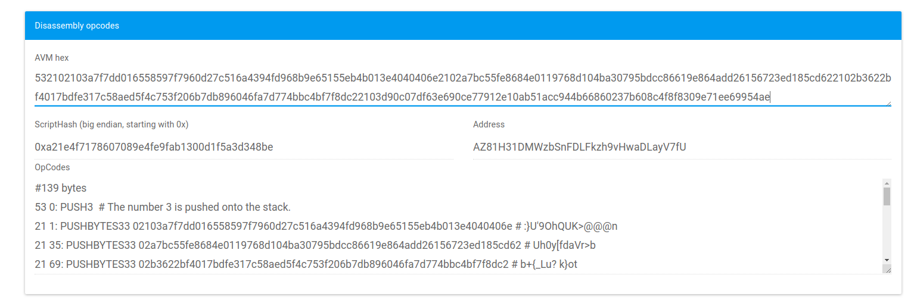
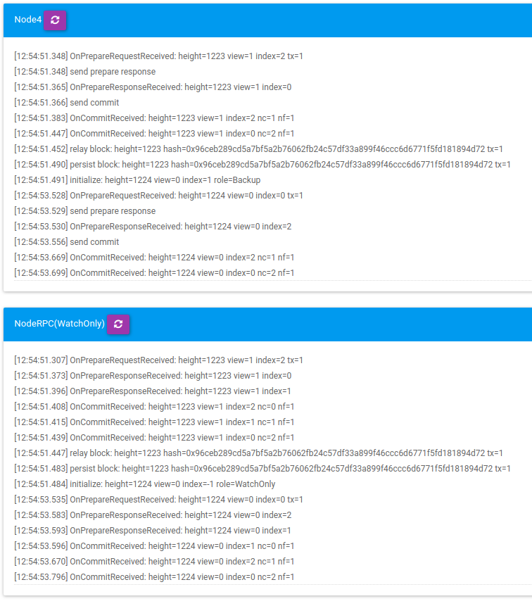

# Introduction

Multi-Agent Systems (MAS) are the core of Internet-of-Things (IoT), in which autonomous devices are able to interact with each other whilst following their own specific goals. Blockchain consensus operates in the same manner, where autonomous nodes aim to reach an agreement through a negotiation protocol despite selfish nodes attempting to maximize their own interests. Typically in the literature, MAS protocols are described as having three pillars for reaching agreements: voting, auction, and coordination.

We believe that blockchain protocols are able to safely perform distributed rational decision making during the consensus process. In particular, this may happen if the right incentives are provided.Incentives are not just directly monetary (though rewards) but also involve prestige and the safeguarding of projects that participating nodes are interested in.

In the case of NEO Consensus Nodes (CN), two key points of this interest can be raised, involving two different spheres:

1) Stakeholders interested in promoting their image as a reliability link for assisting the creation of blocks; 
2) Nodes that want to increase their reputation among the NEO holders, which motivates holders to support their candidature and utilize their services.

The consensus mechanism used by the NEO protocol, named Delegated Byzantine Fault Tolerance (dBFT), has its design rooted in the works of Practical Byzantine Fault Tolerance by Miguel Castro and Barbara Liskov around 1999.

This tutorial will introduce the basic steps for understanding the importance of designing and developing such a mechanism for the NEO ecosystem.

## What we expect that you will learn

After reading this material, it is expected that you will learn:

- Distinguish Proof-of-Work and other consensus mechanisms based on coordination;
- Learn more about cryptography and multi-sig accounts;
- Learn about Byzantine Fault Tolerant systems;
- Comprehend the design of a fully distributed network, in which consensus operates using digital signatures;
- Understand the beauty of **one block finality**.

## The roots of Proof-of-Work

Proof-of-Work was first mentioned by Satoshi Nakamoto as a mechanism that could combine CPU usage with voting, namely one-CPU-one-vote. The basic idea behind this is to create a protocol in which blocks are generating every `X` seconds. If blocks are generated faster or slower, difficulty would be altered.

For instance, let's take the string `NEO Ecosystem` and convert it to a Hash256 `4bf65a74b608f6b785286b5da1d39ceb36ed87b62fee6ba97a65ecd4655b7661`.
Now let's take the string `NEO Ecosystem+Nonce`, let's say `NEO Ecosystem+1` and we would get the following Hash256 `0739bcb67c6e934c669b95d65f1c98cdd67bcef0ef8ab22a7c1b4404f0e11450`.
Next, we will test `NEO Ecosystem+12345678`, resulting in `011c65a33085565814548bc2860a1a3b1c68b627581381382447147788b0240c`, which has its beginning with `01`, less significative than `07`.
Now, start to play with this nonce until you gets words that should start with `0000000000` and you are going to verify how hard this task is.
Hashes are a kind of cryptographic signature for any data file, which has its basin on the classic SHA-256 algorithm that generates nearly unique fixed-size 32 bytes words.
Hashes are so unidirectional that any known algorithm can revert its information, even with the assist of quantum computers.

At the early times of BTC mining, in 2009, a standard computer could produce around 1 megahash per second.
Since then, mining has evolved from GPUs, FPGAs and ASICs, reaching the impressive dedicated power of generating 13 TH/s per second, around 13000000 faster than in the beginning.

If computers and knowledge dedicated in generating hashes has been evolving so drastically, why would not be the same for digital signatures and communication protocols?
IoT has been a hot topic and focus of dedication of renowned researchers and industries, and its roots are related with communication and agreement between autonomous devices.

The roots of NEO dBFT are digital signatures shared by a group of nodes (autonomous agents), which were selected by the majority of all NEO holders.

## Coordination x Proof-of-Stake x Voting

Notoriously, the so-called Proof-of-Stake (PoS) based algorithms have similarities with what we mentioned about MAS.
The core idea of PoS is to leave decision making for those that have more financial health in the Ecosystem, which would motivates them to keep the network running safely and efficiently.
As can be noticed, if we turn this power to those that are part of the ecosystem we would have a similar PoS in which voting would be the main mechanism for selecting such nodes.
The power of voting can even remove those that are acting as promised.

Summarizing this, we should see that coordination is the core for reaching agreement in decentralized scenarios.
Coordination not in the sense of a centralized coordinator, but in the sense that multiple goals are considered when a decision is being taken.

## pBFT

It has been argued that implement a consensus fully based on asynchronous system is not possible, in the work of  *M. Fischer, N. Lynch, and M. Paterson*, "Impossibility of
Distributed Consensus With One Faulty Process", in the Journal of the ACM, in 1985.

In this sense, we must rely on a basic notion of synchrony for providing liveness.

possible [9].
 We guarantee liveness, i.e., clients

A brief summary of the pBFT folows of states can be seen in the .

pBFT was designed for....

## dBFT

**Disclaimer:** *Part of the content of this tutorial has been extracted from the [dBFT formal specification](https://github.com/NeoResearch/yellowpaper/blob/master/sections/08_dBFT.md).*

While the previous aforementioned liveness was proved for pBFT, the scenario in which dBFT works is a real-word large-scale public blockchain with state machine replication. The nature of the information shared is different and information can not be leaked. This required a refined and precisely designed recovery mechanism to be created for dBFT.

The current dBFT 2.0 flow of states can be seen below: 

### One-block finality

One block finality offers significant advantages for real-world applications. For example, end users, merchants, and exchanges can be confident that their transactions were definitively processed and settled, with no chance for them to be reverted. While the NEO blockchain has been designed for hosting Decentralized Applications (DApps), it is noteworthy that persisting SC transactions, which involves State Machine Replication (SMR) and is the core functionality of several DApps, poses a unique set of challenges. Maintaining block finality is a difficult task, as consensus nodes may not expose and reveal the information of duplicated blocks. Due to this, block signatures should be only provided when the majority of consensus nodes are already in an agreement.

This problem has been called as the **indefatigable miners problem** (defined below):

1. The speaker is a Geological Engineer who is searching for a place to dig for Kryptonite;
1. He proposes a geographical location (coordinates to dig);
1. The majority (`M` guys) agrees with the coordinates (with their partial signatures);
1. Time to dig! The miners will now dig until they really find Kryptonite (no other location will be accepted to be dug until Kryptonite is found). Kryptonite is an infinitely divisible crystal, thus as soon as one miner finds some, he will share the Kryptonite so that everyone will have a piece to submit, finishing their contract (3.);
1. If one of the miners dies, it will resurrect, see the agreement it previously signed (3.), and will automatically start to dig again. The other miners will suffer the same, and also receive hidden messages saying that they should also dig.

### Blocking changing views and giving the network extra time

For preserving liveness, and additional property needed to be ensured:

- Nodes should be blocked to commit their signatures if they do not believe in the current network topology (asked `change_view`).

However, in practice, summed up with the Commit phase locking, the dBFT had lost liveness in some case in which nodes were just with network problems.
A workaround for this problem was to introduce a counting mechanism for checking committed nodes (easy to check) and failed nodes (those that you have not been in touch in the last blocks).
This mechanism ensured an extra layer of protection before asking for changing view.

Along with this, another strategy that has been designed was to avoid `change_views` when nodes are seeing progress on the network.
In this sense, each time that nodes shared signed information between them, extra timeout are added to their internal timers, summarizing that nodes are reaching agreements and communicating between them.

### A 4-node consensus

As you may already known, an address in the NEO blockchain 2.x is formed by `21`, which means ["Push 34 bytes on the evaluation stack"](https://github.com/neo-project/neo-vm/blob/f81c3039d5fb4417b3c1ad780378c7f92499964a/src/neo-vm/OpCode.cs#L144), the public key and `ac`, which is an opcode that invokes an script for checking witness of the address.

We suggest readers to take a look at the following article:

- [Understanding MultiSig on NEO](https://medium.com/neoresearch/understanding-multisig-on-neo-df9c9c1403b1).

Let's consider nodes with the following pubkeys (21+rootOfPubKey+ac):

- N1: `2102103a7f7dd016558597f7960d27c516a4394fd968b9e65155eb4b013e4040406eac`
- N2: `2102a7bc55fe8684e0119768d104ba30795bdcc86619e864add26156723ed185cd62ac`
- N3: `2102b3622bf4017bdfe317c58aed5f4c753f206b7db896046fa7d774bbc4bf7f8dc2ac`
- N4: `2103d90c07df63e690ce77912e10ab51acc944b66860237b608c4f8f8309e71ee699ac`

Basically, a trivial way to create a multi-signature account can be done using the following script:

`532102103a7f7dd016558597f7960d27c516a4394fd968b9e65155eb4b013e4040406e2102a7bc55fe8684e0119768d104ba30795bdcc86619e864add26156723ed185cd622102b3622bf4017bdfe317c58aed5f4c753f206b7db896046fa7d774bbc4bf7f8dc22103d90c07df63e690ce77912e10ab51acc944b66860237b608c4f8f8309e71ee69954ae`

which is: `53` (number of signers) + `21` + `02...6e` + `21` + `02...62` + `21` + `02...c2` + `21` + `03...99` + `54` (number of owners) + `ae`

We a holders pick those 4 nodes as their desired validators, the following script will be one signing every block, with the following public address: `AZ81H31DMWzbSnFDLFkzh9vHwaDLayV7fU`.
The latter can be achieved by converted that script to "Scripthash big-endian" and then converting to base-58.
We suggest readers to access [NeoCompiler-Eco](https://neocompiler.io/#!/ecolab/conversor) if they want to play with these conversors.

### A simple single-node consensus

Let's take the first node (N1) previous described and create a multi-signatures acount with 1 owners and one signers by just switing `53` and `54` to `4f`.

`512102b3622bf4017bdfe317c58aed5f4c753f206b7db896046fa7d774bbc4bf7f8dc251ae`

The latter would result in the following Address: `AbU69m8WUZJSWanfr1Cy66cpEcsmMcX7BR`

### Watch-only consensus nodes

As could be verified in the [Network tutorial](linkToNetworkTODO), NEO network operates in a fully distributed fashion, such as this figure above, extracted from this [Medium Article](https://medium.com/neoresearch/understanding-neo-network-in-five-pictures-e51b7c19d6e0):

The green boxes represents consensus, which are emerged in the pool of nodes.
Messages are all broadcasted to neighbors (in an optimal scenario).
Nodes with special feature can be designed for just monitoring the CN P2P messages, as can be accesed here in the [NeoCompiler Eco Shared Privatenet](https://neocompiler.io/#!/ecolab/cnnodesinfo).

In this figure, this Watch-Only node also has the feature of RPC.
It is noteworthy that nodes can have special features and summarize any information desired by those that manage that client, as already emphasized in the [Tutorial](./linkToPluginsTodo).

### dBFT scenarios

We will now outline possible consensus scenarios, using the following characters to represent nodes:

- **N1:** Erik Zhang, the Jedi Master;
- **N2:** Da Hongfei, the hearth of the Smart Economy;
- **N3:** Peter Lin, the truth in the hearth;
- **N4:** NEO Ecosystem, the sum of all projects and interests of users, exchanges, and developers;
- **N5:** City of Zion, the combination and partnership of individuals around the world;
- **N6:** NeoResearch Butterfly, the ability to explore, recover, and transform;
- **N7:** Master Yoda, learning from past.

By using these 7 consensus nodes and their virtues, we are going give some examples that may enlighten the mind of the readers about how dBFT may work:

#### The Genesis Block

Genesis block is created with 3 transactions, in which native assets NEO and GAS are created then subsequently transferred to a multi-signature account composed of the current validators.

#### Case 1 (normal operation)

- We are at Height `1` and view `0`, the primary will be `N1`(considering a didactic formula);
- Erik Zhang picks the first set of transactions, signed by the multi-sig accounts, and proposes a block `b_1_0`;
- `2f+1`nodes needs to agree with the proposal. Nodes N2, N3, N4, and N5 are the first ones to reply with their agreement on this block. Together with N1, they reach the required total of 5 (exactly 2f +1);
- N1, ..., N5 will probably be the ones that are first to enter into the commit phase.
- Those that are in the commit phase will automatically send their signature for the current block proposal `b_1_0`;
- As soon as a node sees `2f+1` signatures, it can broadcast a valid block to the network. Even a **watch-only node** could be the first one to perform this task (which highlights how this MAS enviroment may work).

#### Case 2 (faulty primary)

- We are at Height `2` and view `0`, the primary will be `N2`;
- Da Hongfei took a brief nap and was not able to communicate with the other characters for a few seconds;
- `2f+1` nodes agreed that they should `change_view`. No progress on the network has occurred, and they should timeout exactly with `blocktime` shifted 1 bit. In the case of a 15 second block time, it would be after 30s;
- The primary will change to N3;
- N3 will propose a block only if it has participated in the `view_change`, otherwise it would still be waiting for `N2` to propose a block;
- Considering that N3 received `2f+1` `change_view` messages, it would now proposes a block `b_2_1`;
- The standard flow outlined in Case 1 would happen from here.

#### Case 3 (faulty after commit)

- We are at Height `3` and view `0`, the primary will be `N3`;
- N3 proposes a block `b_3_0`
- The majority agrees, from `N3`, ..., `N7`;
- However, after entering into the commit phase, `N4` dies before broadcasting its signature for `b_3_0`;
- `N3`, `N5`, `N6` and `N7` are just `2F` and are still need one more signature for `b_3_0`. The possibilities are: 1) `N4` will recover from its fault; 2) `N1` and `N2` would see the messages they lost; 3) `N1` and `N2` will ask for `change_view` but will not have the majority `M` and the other nodes will reply to them with a `Recovery` message, in which they would automatically receive all known messages. As soon as any of these 3 nodes receive such messages, they will continue to contribute to the current block `b_3_0`.

It should be noticed that 3 faulty nodes are `f+1` which is expected to halt the progress of the network. On the other hand, it should be noticed that no real Byzantine behavior was really detected, only delays and connections problems. In this sense, it is expected that due to the partially synchronous protocol, messages will eventually arrive at these nodes.

#### Case 4 (Byzantine Primary)

- We are at Height `4` and view `0`, the primary will be `N4`;
- `N4` is malicious and decides to send different block proposals to the network;
- Each node is designed to just accept a single proposal per `view`. Until the majority `M = 2f+1` nodes reach an agreement on the same proposal (summarized by the `hash`), no nodes will be committed;
- If `M` nodes commit and the other `f = 2` cached a different proposal, they will receive a `Recover` message at some time, which will allow them to match the hashes. If the hashes are different we have proof of malicious activity by the primary, which would surely make NEO holders to remove him as a validator.

## Practical exercise (hands-on)

We suggest that those interested in initializing, testing, and observing dBFT consensus to take some time to view [NeoCompiler-Eco Github](https://github.com/NeoResearch/neocompiler-eco), following its guidelines for setting up a local blockchain system. Follow the [README](https://github.com/NeoResearch/neocompiler-eco/blob/master/README.md) and the steps described therein to initialize the consensus nodes on your private network according to your desired specification.
