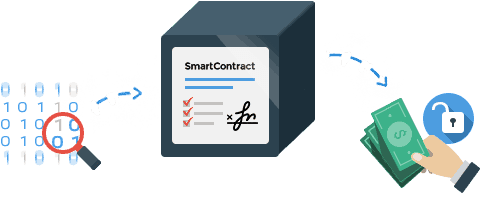

# What is smart contract

##The popularity of smart contract

Have you heared about smart contract before? Recently, the word "smart contract" is discussed by everyone who are interested in the blockchain or even those who do not know blockchain. The concept of smart contract was pointed by Nick Szabo in 1994

> A smart contract is a computerized transaction protocol that executes the terms of a contract. The general objectives are to satisfy common contractual conditions.

He called these new contracts "smart", because they are far more functional than their paper-based ancestors. No use of artificial intelligence is implied. A smart contract is a set of promises, specified in digital form, including protocols within which the parties perform on these promises.

From the blockchain's Perspective, a smart contract is a set of commitments that are defined in digital form, including the agreement on how contract participants shall fulfill these commitments. Blockchain technology gives us a decentralized, non-tampering, highly reliable system in which smart contracts are extremely useful. Smart contracts is one of the most important characteristics of blockchain technologies and the reason why blockchains can be called disruptive technology. It is increasing the efficiency of our social structure by each passing day.

Let's comparet the smart contract with vending machines. In the real world, after inserting 10 dollars and press button, you will get the thing like potato chips which you expected. In the smart contract, you drop some digital coin and data, you will get the expected outcome, e.g. driver licence, into your own account. Smart contract is self-executing and is moitord by thounds of people, which makes it immutable and independent from centralization.

 

## The merit of smart contract

- Autonomy. 
Smart contract are indenpendly running on the computers which spread the world and no rely on any centrailized system.
- Trust
The trust is based on the distributed ledgers that execute and validates the contract.
- Robustness
The smart contract is on the distributed network, loss or destroy of a single point is not working. 
- Speed
The decentralized processing of smart contract let the procedure of business can be finished in a short time.
- Economy
Smart contract eliminated the need for a vast chain of middlemen includes lawyers, witness and other intermediatries.
## NEO  smart contract